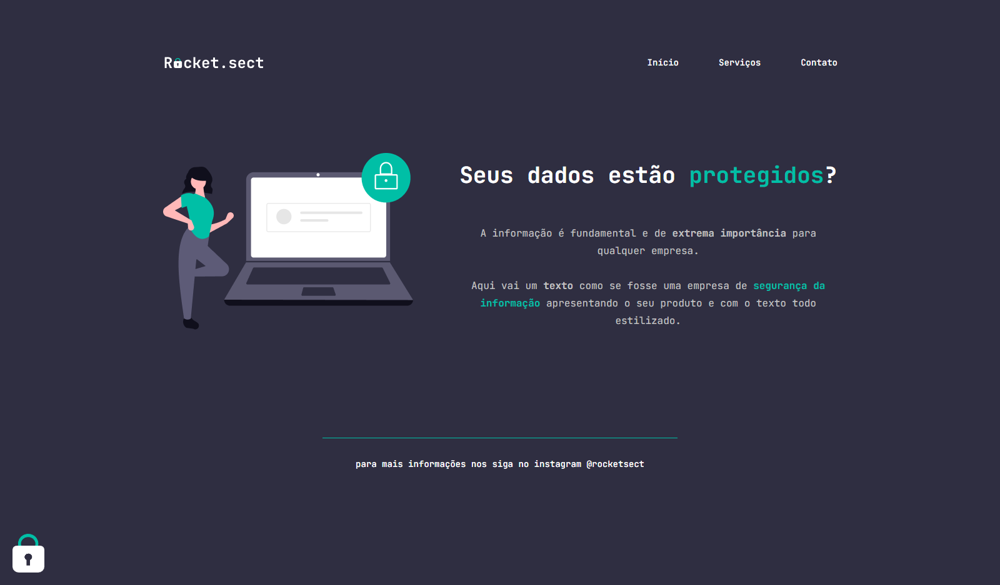

# Explorer - Project 02

> Landing Page

Project built as a challenge throughout the second module (Stage 02) of the Explorer course at Rocketseat.
This is a simple landing page for a cyber security business.

[Click here to view](https://jessicaranft.github.io/explorer-desafio-recriandoLayout/)

## Technologies

- HTML
- CSS

## Software

- Visual Studio Code
